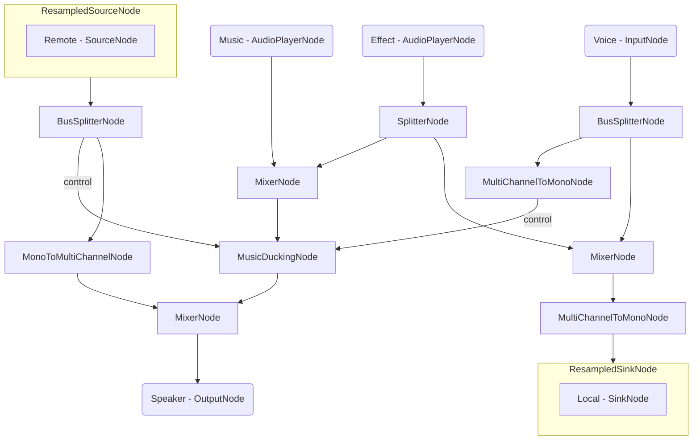

# Ducking And Sound Effects App - Android

## Important Links

<a href="https://docs.switchboard.audio/docs/examples/ducking-and-sound-effects-app/" target="_blank">Find more info on the Ducking And Sound Effects App HERE</a>

<a href="https://docs.switchboard.audio/" target="_blank">Find more info on the Switchboard SDK HERE</a>

## About Ducking And Sound Effects

*Providing your users with the best audio experience is essential for any communication app.*

*Ducking down your music while voice communication is active makes a fine distinction between different audio sources, while playing audio effects can spice up user interactions.*

*In this example we will extend the functionality of the Voice Communication App*

## Ducking And Sound Effects App

The app has the following **features** over the Voice Communication App:

- Playing audio effect which is also transmitted in the active room
- Lowering music and effect volume when there is voice activity in the room

It consists of the following single **screen**:

- ***Room Screen:*** Voice communication in a room, custom username and room name setting, user presence list and play music and sound effect button.

### Room Screen

The room screen consists of a username and room name input field, a join button and a user presence list and play music and play sound effect button.

To be able to join a room a username and a room name has to be entered. After joining a room the voice communication is possible with the remote parties in the same room.

After joining a room pressing the play sound effect button plays it locally while also transmitting it through the room to the other users.

The user is also able to listen to music, which is only played locally.

#### Audio Graph

The audio graph for the Room screen looks the following:

This graph might look daunting compared to the Voice Communication App's graph but upon closer inspection we can distinguish separate functions.

Let's start with the players. We have two separate players as their outputs are routed differently. The Music Player only needs to be played locally while the Effect Player has to be transmitted in the room as well.

The Ducking Node has two different input types. The first one is the audio which needs to be ducked, while the rest are the control audio which indicates when the audio needs to be ducked.

The ducked audio is the mix of the Music and Effect player as we want to lower both the Music and the Effects when somebody is speaking.
Multiple controls can be routed to the Ducking Node so the user’s microphone input and the audio from Agora can be routed separately.
