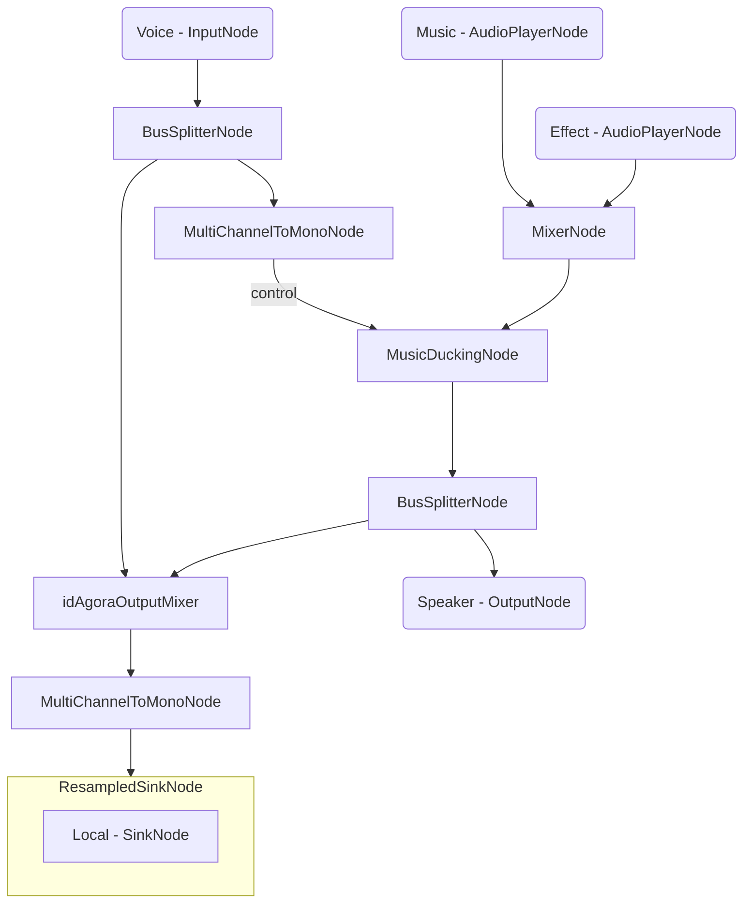
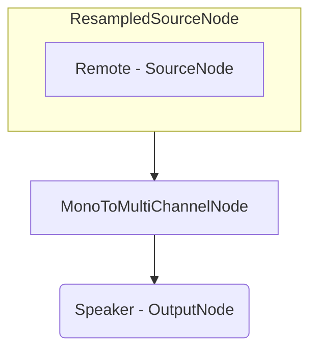

# Online Radio App - Android

## Important Links

<a href="https://docs.switchboard.audio/docs/examples/online-radio-app/" target="_blank">Find more info on the Online Radio App HERE</a>

<a href="https://docs.switchboard.audio/" target="_blank">Find more info on the Switchboard SDK HERE</a>

## About Online Radio

*Online radio apps have revolutionized the way we listen to music and stay connected to our favorite radio stations.*

*These apps provide a seamless and convenient listening experience, allowing us to discover new music, stay updated with the latest news and events.*

*In this example we will create an app for real-time online radio experience over the internet, with the ability to broadcast voice, music and interesting sound effects to multiple people in the same virtual channel. The SDK allows you to easily integrate your app with the most common audio communication standards and providers.*

## Online Radio App

The app has the following **features**:

- Broadcasting audio as a host
- Listening to the host in a channel
- Ability to join arbitrarily-named channels
- Ability to broadcast music in a channel as a host
- Ability to broadcast sound effects in a channel as a host

It consists of the following **screens**:

- ***Role Selection:*** Select your role in the online radio app: host or listener
- ***Host:*** Broadcast your voice, music and sound effects in a channel with ducking applied to the audio
- ***Listener:*** Listen to the host in a channel

### Role Selection

The role selection screen consists of two buttons for role selection.

Selecting *I am a host* takes you to the host screen where you can broadcast audio.

Selecting *I am a listener* takes you to the listener screen where you can listen to a host.

### Host

The Host screen consists of a channel name input field, a broadcast start button and play music and play sound effect buttons.

To be able to start broadcasting a channel name has to be entered. After starting the broadcast audio is broadcasted to the remote listeners in the same channel.

Pressing the play sound effect button plays it locally while also transmitting it through the room to the other users.

If you talk, the music and sound effects are ducked and your voice can be heard better by the listeners.

#### Audio Graph

The audio graph for the Host screen looks the following:

The host's microphone input is transmitted into the channel.

We have two separate players for the music and the sound effect. The Music Player and the Effect Player has to be transmitted in the channel as well.

The Ducking Node has two different input types. The first one is the audio which needs to be ducked, while the rest are the control audio which indicates when the audio needs to be ducked. The control audio in this case is the host's microphone input.

The ducked audio is the mix of the Music and Effect player as we want to lower both the Music and the Effects when the host is speaking.

### Listener

The Listener screen consists of a channel name input field and a listen button.

To be able to start listening a channel name has to be entered. After pressing the listen button audio can be heard coming from the host in the same channel.

#### Audio Graph

The audio graph for the Listener screen looks the following:

The source ResampledNode is needed to resample the signal from the device sample rate to the communication systems audio bus sample rate. The source node receives the remote audio and it is routed to the speaker output.
