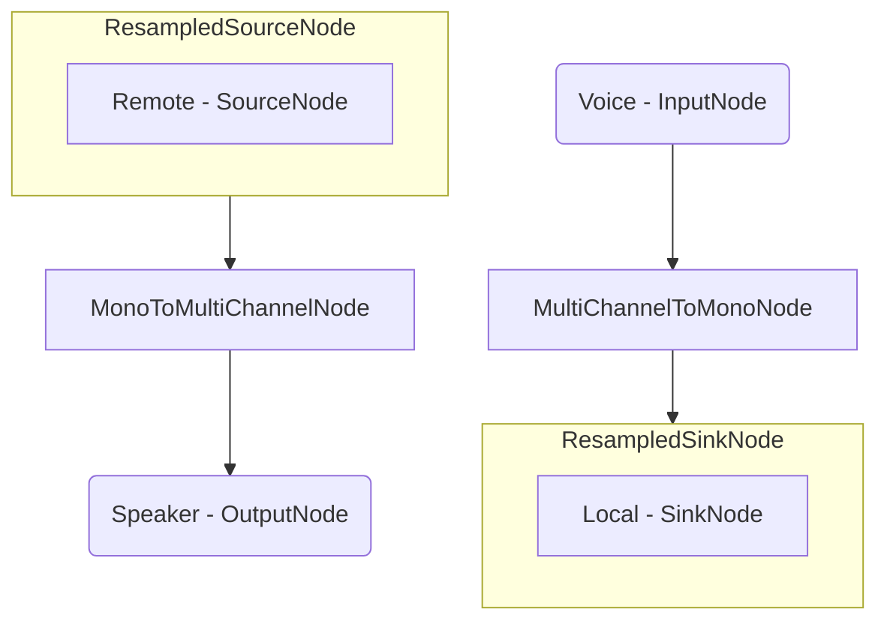

# Voice Communication App - Android

## Important Links

<a href="https://docs.switchboard.audio/docs/examples/voice-communication-app/" target="_blank">Find more info on the Voice Communication App HERE</a>

<a href="https://docs.switchboard.audio/" target="_blank">Find more info on the Switchboard SDK HERE</a>

## About Voice Communication

*Voice communication software is one of the most important tools in today's digital age.*

*It allows individuals and businesses to connect and communicate in real-time, regardless of geographical barriers.*

*The ability to hear someone's voice adds a personal touch to conversations, enabling better understanding and interpretation of emotions and intentions.*

*In this example we will create an app for real-time voice communication over the internet, with the ability to communicate with multiple people in the same virtual room.*

## Voice Communication App

The app has the following **features**:

- Two-way voice communication with multiple users in a room
- Ability to enter custom username
- Ability to join an arbitrarily-named room
- User presence in a list form

It consists of the following single **screen**:

- ***Room Screen:*** Voice communication in a room, custom username and room name setting, user presence list

### Room Screen

The room screen consists of a username and room name input field, a join button and a user presence list.

To be able to join a room a username and a room name has to be entered. After joining a room the voice communication is possible with the remote parties in the same room.

#### Audio Graph

The audio graph for the Room screen looks the following:

The source and sink ResampledNodes are needed to resample the signal from the device sample rate to the communication systems audio bus sample rate. Our microphone input is routed to a sink node for transmission. The source node receives the remote audio and it is routed to the speaker output.
